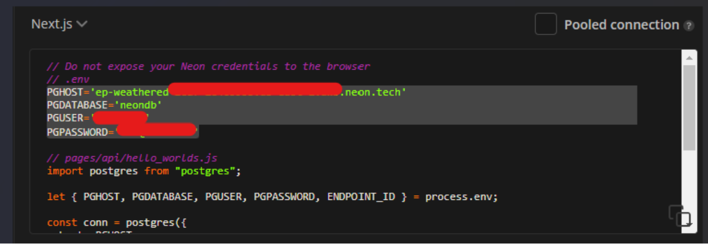
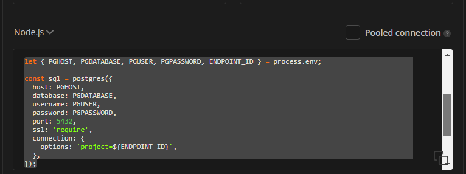

# node-rest-api

* This is a REST API Node.js application, created for video management.  
<br/>
* Create your Postgres relational database using [Neon.tech](https://neon.tech/)  
<br/>
* Project deployed on [Render](https://render.com/)  


### Postgres installation using Neon

* Create a project on [Neon.tech](https://neon.tech/)  

* Create a sql database instance (db.js) following [these steps](https://github.com/porsager/postgres)  

* Create a .env file and copy+paste Neon credentials to it:   
  

* Install DotENV extension to VSCode  

* Install dotenv -D  
```bash
npm install dotenv -D
```  

* Copy database connection scripts from Neon and paste them on db.js file:  
  

-- db.js should be like this:  
```javascript
import 'dotenv/config' // read my .env file, save all my variables to process.env to make them available here
import postgres from 'postgres'

const { PGHOST, PGDATABASE, PGUSER, PGPASSWORD, ENDPOINT_ID } = process.env;

export const sql = postgres({
  host: PGHOST,
  database: PGDATABASE,
  username: PGUSER,
  password: PGPASSWORD,
  port: 5432,
  ssl: 'require',
  connection: {
    options: `project=${ENDPOINT_ID}`,
  },
});
```  

* Create a .js file to create a table, using this SQL statement below (check create-table.js file):  
```sql
CREATE TABLE videos (
    id serial PRIMARY KEY,
    title VARCHAR(255) NOT NULL,
    description TEXT,
    duration INTEGER
);
```  

*To create the table, run:  
```bash
node create-table.js
```

* Create database-postgres.js to manage CRUD operations  

<br/>

## Deploying on Render  

* Create an account  

* Click on New+ button

* 


